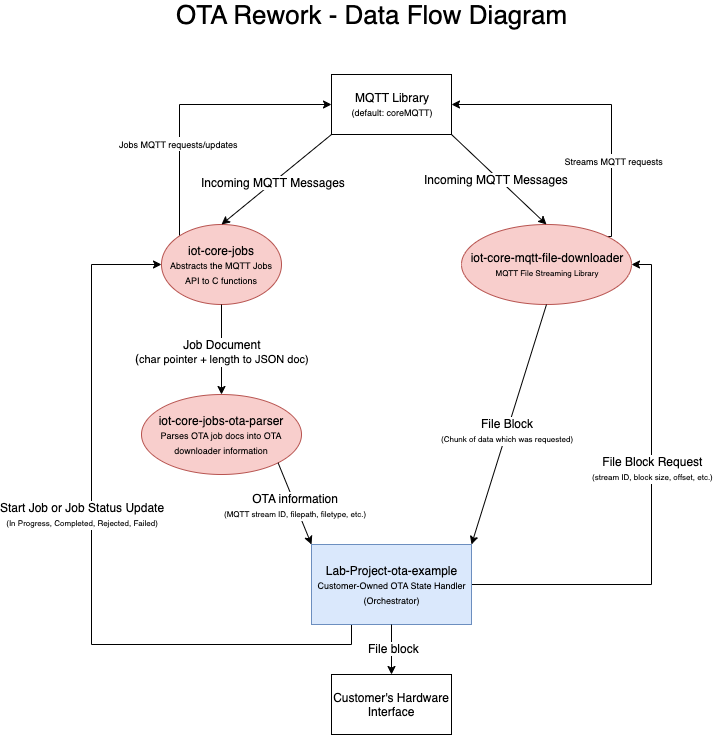

# CoreOTA
## Concepts
### Basic Flow Flow
CoreOTA in its most basic form helps to make implementing the overall OTA flow as simple as possible. This general flow of an OTA update looks as follows:

  

**Notify** - The device is notified of a pending Over The Air update. This notification is starts the process of deciding how to handle the update. The device may choose to ignore the update or accept the update triggering the download. The device will notify the OTA update provider of it's choice.

**Download** - The device begins downloading the OTA update over any one of it's supported protocols. The device will download the update to a pre-selected storage region. This update may be an entirely new firmware image or a patch to the existing firmware.

**Verify** - The device performs various checks to ensure authenticity of the downloaded firmware. A robust verification state prevents malicious actors installing firmware, device corruption, and incorrectly signed updates from taking place.

**Install** - The device now updates itself (often through a bootloader) to the newest firmware. Checks may be performed after install to verify functionality. The device will report the successful firmware update to the OTA update provider.

## Architecture
Central to CoreOTA's design is the desire for extensability, customizability, and configurability. These traits are criticial to ensure that CoreOTA can work on your device with as a little rework as possible. Extensibility manifests in the form of simplified components which can easily be expanded for enhanced functionality. CoreOTA remains customizable through swappable components with robust interfaces allowing for new protocols, update providers, and download schemes to coexisting with already implemented ones. And finally, simple configurability through easy to modify values setting important behaviors like download chunk sizing.

These values are implemented through the use of several small 'libraries', each contained in a 'lib' sub directory. These libraries are each responsible for a different component of the OTA update allowing for a modular and composable set of functionality. Note that all of these components can be replaced to support new protocols, OTA update methods, and formats.

The dataflow through the various components will look like...

  

Now for ane explanation of the various components...

### The 'IoT Jobs Handler'
**Found in `iot-core-jobs`**

The IoT Jobs handler is the first component used in the overall OTA flow. This library provides functions to both start a pending IoT Job (shown as Notify on the diagram below) as well as update a job's status. When the Jobs handler learns of a new OTA update - coming through an IoT job - the handler will start the job and pass the job and it's metadata on to a chain of parsers. If a parser is setup to handle the job then it will relay back to the job handler that the job was started succesfully. This successful start notification is relayed back to the OTA update provider (which is IoT Jobs) to mark the update as started. If no parser is able to understand the job then the failure to start the OTA update is relayed to the provider.

### The 'IoT OTA Parser'
**Found in `iot-core-jobs-ota-parser`**

The OTA parser found in `iot-core-ota-parser` is a single example of an OTA update parser. The parser will verify the IoT job is an OTA update and parse the fields into a usable format before calling on the downloader.

### The 'File Downloader'
**Found in `iot-core-mqtt-file-downloader`**

The file downloader provides functionality to download the OTA file. The file downloader handles downloading the update over an MQTT stream in either CBOR or JSON format. The download itself if performed on 'blocks' which is easier to think of as chunks of the overall OTA update file. This is done to increase the reliability of the download as well as to allow for larger firmware updates than possible in a single download 'block'.

### The 'Bootloader'
A firmware Bootloaderexists to install the new firmware onto the device. CoreOTA deliberately avoids implementing a bootloader as several industry-wide bootloaders already exist with a large range of supported microcontrollers. CoreOTA leaves the choice of the bootloaded and it's features up to the user.

### The 'Orchestrator'
**An example orchestrator can be found in `demo/ota_demo.c`**

And finally the orchestrator synchroinizes all of the components mentioned above along with a bootloader and memory pool to perform the OTA update once downloaded. Think of the orchestrator as the leader of a symphony - it orders the other components to make an OTA update possible, from being notified to downloading to later installing the firmware.
